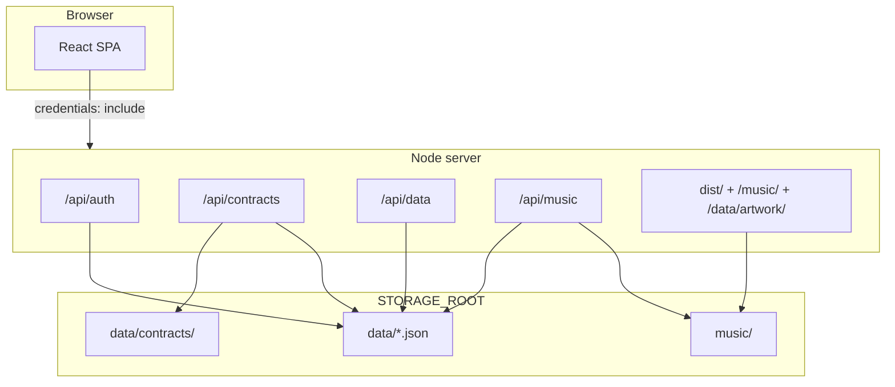

# DjCoordinationApp — Technical & Development Guide

A full-stack DJ coordination platform for wedding and event clients. Couples log in with a code, complete a preferences wizard, browse and rate music, and sign digital contracts. The DJ manages everything from an admin panel.

---

## Table of contents

1. [Overview](#overview)
2. [Tech stack](#tech-stack)
3. [Repository layout](#repository-layout)
4. [Architecture](#architecture)
5. [Development setup](#development-setup)
6. [Production & deployment](#production--deployment)
7. [Environment variables](#environment-variables)
8. [Data & storage](#data--storage)
9. [Authentication](#authentication)
10. [Routing](#routing)
11. [Feature areas](#feature-areas)
12. [API reference](#api-reference)
13. [Contracts system](#contracts-system)
14. [Music catalog](#music-catalog)
15. [Frontend patterns](#frontend-patterns)
16. [Scripts](#scripts)
17. [Security notes](#security-notes)

---

## Overview

| Role | What they do |
|------|----------------|
| **Admin (DJ)** | Upload music, organize genres, build forms, manage clients, design contract templates, review feedback |
| **Client (couple)** | Log in with code → home dashboard → wizard → catalog → contract signing |

The app is a **single-page React application** served by a **Node HTTP server**. There is no separate database — persistence is **JSON files on disk** plus uploaded media (MP3, PDF, artwork).

**Package name:** `dj-pool-demo`  
**Entry points:**
- Frontend: `src/main.jsx` → `src/App.jsx` → `src/DJPoolDemo.jsx`
- Backend: `server.js` (production) / Vite dev middleware (development)

---

## Tech stack

| Layer | Technology |
|-------|------------|
| UI | React 19, Tailwind CSS 4 |
| Build | Vite 8 |
| Server | Node.js (native `http`, no Express) |
| Audio playback | wavesurfer.js |
| Contracts (view) | PDF.js (`pdfjs-dist`) |
| Contracts (stamp) | pdf-lib + Noto Sans Hebrew font |
| Transcoding | ffmpeg-static (optional MP3 compression on upload) |
| i18n | Custom context + `translations.js` (Hebrew / English) |

---

## Repository layout

```
DjCoordinationApp/
├── server.js                 # Production HTTP server (API + static SPA)
├── vite.config.js            # Dev server + API middleware plugins
├── render.yaml               # Render Blueprint (deploy config)
├── .env.example              # Environment variable template
│
├── src/
│   ├── DJPoolDemo.jsx        # Main app shell (routing, state orchestration)
│   ├── App.jsx               # Root wrapper (i18n provider)
│   ├── components/           # UI components (admin + client)
│   ├── hooks/                # Domain state hooks (clients, contracts, feedback…)
│   └── lib/                  # Business logic, API clients, utilities
│       ├── api/              # fetch wrappers for /api/*
│       ├── i18n/             # Translations & settings context
│       ├── contractFields.js # Contract field model & sync logic
│       ├── clientDetails.js  # Client attribute snapshots for contract sync
│       └── contractTickets.js
│
├── server/
│   ├── dataStore.js          # JSON file CRUD (/api/data/*)
│   ├── auth.js               # HMAC-signed cookie sessions
│   ├── authApi.js            # Login / logout / session
│   ├── contractApi.js        # Contract templates, tickets, signing
│   ├── contractSignedCopy.js # PDF stamping after signature
│   ├── catalogMusic.js       # Track catalog + disk verification
│   ├── uploadMusic.js        # /api/music/* endpoints
│   ├── storagePaths.js       # STORAGE_ROOT resolution
│   ├── dropboxImport.js      # Dropbox OAuth import
│   ├── backupApi.js          # Admin backup export
│   └── artworkApi.js         # Album artwork fetch
│
├── public/                   # Local dev storage root (when STORAGE_ROOT unset)
│   ├── data/                 # Runtime JSON + contracts
│   └── music/                # MP3 files by genre
│
├── dist/                     # Vite build output (served in production)
├── scripts/                  # Build, deploy, waveform, backup utilities
└── docs/
    └── PROJECT.md            # This file
```

---

## Architecture



### Dev vs production

| Mode | Command | How APIs work |
|------|---------|---------------|
| **Development** | `npm run dev` | Vite dev server mounts the same middleware from `server/*.js` via `vite.config.js` plugins |
| **Production** | `npm run build && npm start` | `server.js` serves built `dist/` and handles all `/api/*` routes |

Both modes share the same API handler code. Business logic in `src/lib/` is imported by the server where needed (e.g. `contractFields.js`).

### Request middleware order (production)

Defined in `server.js`:

1. `GET /health`
2. Auth API
3. Contract API
4. Data API
5. Music upload API
6. Dropbox import API
7. Artwork API
8. Backup API
9. API 404 handler
10. Media auth (`/music/`, `/data/artwork/`)
11. Static files from `dist/` (SPA fallback to `index.html`)

---

## Development setup

### Prerequisites

- Node.js 18+ (20+ recommended)
- npm

Optional:
- Python (for `scan-music` and `fetch-artwork` scripts)
- Dropbox app credentials (for import feature)

### Quick start

```bash
git clone <repo>
cd DjCoordinationApp
npm install
cp .env.example .env   # edit as needed
npm run dev
```

Open **http://localhost:5173**

- **Admin:** navigate to `/admin` — in dev without `ADMIN_SECRET`, auth is bypassed for local work
- **Client:** create a client in admin → use the login code on the welcome screen

### Local storage

Without `STORAGE_ROOT`, data lives under `public/`:

```
public/data/clients.json
public/data/feedback.json
public/data/catalog.json
public/data/form-schema.json
public/data/contracts.json
public/data/app-settings.json
public/music/{genre}/...
```

> **Do not commit** runtime JSON or MP3 files. See `scripts/runtimeDataPaths.js` for excluded paths.

### Linting

```bash
npm run lint
```

---

## Production & deployment

### Build

```bash
npm run build   # vite build + storage bootstrap script
npm start       # node server.js on PORT (default 4173)
```

The server binds to `0.0.0.0:$PORT` (required on Render).

### Render (recommended)

`render.yaml` defines:

- **Web service** — Node, `npm ci && npm run build`, `npm start`
- **Health check** — `GET /health`
- **Persistent disk** — 10 GB at `/var/data` (`STORAGE_ROOT=/var/data`)

Set secrets in the Render dashboard:

- `ADMIN_SECRET` (required)
- `SESSION_SECRET` (optional, defaults to `ADMIN_SECRET`)
- `VITE_DROPBOX_APP_KEY`, `DROPBOX_REFRESH_TOKEN` (optional)

### Deploy script

```bash
npm run deploy   # uses scripts/deploy.mjs — excludes local runtime data
```

---

## Environment variables

| Variable | Required | Description |
|----------|----------|-------------|
| `ADMIN_SECRET` | **Yes in production** | Admin password; also used for session signing if `SESSION_SECRET` unset |
| `SESSION_SECRET` | No | Separate HMAC key for session cookies |
| `STORAGE_ROOT` | Render: yes | Root for `data/` and `music/` (e.g. `/var/data`) |
| `NODE_ENV` | Production | `production` enables auth enforcement |
| `REQUIRE_AUTH` | No | Set `0` to disable auth locally (debug only) |
| `PORT` | No | HTTP port (default `4173`) |
| `AUDIO_TRANSCODE` | No | `1` (default) compress MP3 on upload via ffmpeg |
| `AUDIO_BITRATE` | No | Default `128k` |
| `VITE_DROPBOX_APP_KEY` | Dropbox only | Client-side OAuth app key |
| `DROPBOX_REFRESH_TOKEN` | Dropbox only | Server-side refresh token for import |

See `.env.example` for a copy-paste template.

---

## Data & storage

### JSON files (`DATA_DIR`)

| File | Contents | Admin write | Client read |
|------|----------|-------------|-------------|
| `clients.json` | Client records (name, login code, event date/location, stage toggles) | ✓ | Own session only |
| `feedback.json` | Per-client ratings, comments, preferences, wizard progress | ✓ | Own record |
| `catalog.json` | Track metadata array | ✓ | Authenticated |
| `form-schema.json` | Dynamic preference form definition | ✓ | Authenticated |
| `app-settings.json` | Theme, text overrides | ✓ | Public read |
| `contracts.json` | `{ templates: [], tickets: [] }` | ✓ | Filtered by role |

Writes use atomic rename (`*.tmp` → final) in `dataStore.js`.

### Client record shape (simplified)

```json
{
  "id": "client_...",
  "name": "יוסי כהן",
  "loginCode": "ABC123",
  "clientType": "wedding",
  "eventDate": "2026-08-15",
  "eventLocation": "תל אביב",
  "stages": { "form": true, "catalog": true, "contract": true }
}
```

### Stage toggles

Per-client flags in `stages` control which client screens are available:

| Stage ID | Client screen |
|----------|---------------|
| `form` | `/wizard` |
| `catalog` | `/browse` |
| `contract` | `/contract` |

Managed in `ClientManager` via `src/lib/clientStages.js`.

---

## Authentication

Implemented in `server/auth.js` + `server/authApi.js`.

- **Mechanism:** HMAC-signed cookie (`km_session`), 7-day expiry
- **Admin login:** `POST /api/auth/admin` with `{ password }` — checked against `ADMIN_SECRET`
- **Client login:** `POST /api/auth/client` with `{ loginCode }` — matched against `clients.json`
- **Session check:** `GET /api/auth/session`
- **Logout:** `POST /api/auth/logout`

All API calls from the frontend use `credentials: "include"`.

**Dev bypass:** When `NODE_ENV !== "production"` and `ADMIN_SECRET` is unset, admin APIs are open (for local development only).

**Production:** `assertProductionSecrets()` exits the process if `ADMIN_SECRET` is missing.

---

## Routing

Client-side routing via `useAppRouter` + `src/lib/appRoutes.js` (History API, no React Router).

### Client area

| Path | Screen | Auth |
|------|--------|------|
| `/` | Welcome / login | Guest |
| `/home` | Client dashboard | Client |
| `/wizard` | Preferences wizard | Client |
| `/browse` | Music catalog | Client |
| `/contract` | Contract signing | Client |
| `/guide` | Drops & genres guide | Guest |
| `/tutorial` | Tutorial | Guest |
| `/c/:token` | Public contract link | Guest (token) |

### Admin area

| Path | Tab |
|------|-----|
| `/admin` | catalog (default) |
| `/admin/organize` | Genre organizer |
| `/admin/order` | Track order preview |
| `/admin/clients` | Client manager |
| `/admin/contracts` | Contract templates |
| `/admin/form` | Form builder |
| `/admin/copy` | Site text editor |
| `/admin/analytics` | Dashboard |
| `/admin/settings` | Settings & backup |

Admin access requires `/admin` + `AdminGate` password + valid session.

---

## Feature areas

### 1. Client onboarding

1. Admin creates client (name, date, location required) in **Clients** tab
2. Optional: assign contract template on creation → server creates ticket with synced field values
3. Client logs in with code on welcome page
4. **Home** (`ClientHome`) shows progress and shortcuts

### 2. Preferences wizard

- Schema defined in **Form** tab (`FormBuilder`)
- Steps rendered by `PreferencesWizard` + `DynamicWizardStep`
- Answers saved to `feedback.json` under client ID
- Progress tracked in `src/lib/wizardProgress.js`

### 3. Music catalog

- Tracks in `catalog.json`, files in `music/{genre}/`
- Multiple versions per track (`src/lib/trackVersions.js`)
- Client browses, rates (stars), comments
- Global player (`GlobalPlayer`) with waveform preview
- Admin: upload, relink missing files, verify disk, Dropbox import

### 4. Contracts

See [Contracts system](#contracts-system) below.

### 5. Admin settings

- Themes, appearance, accessibility
- Backup export (`/api/admin/backup-export`)
- Dropbox OAuth callback at `/dropbox/callback`

---

## API reference

### Auth — `/api/auth`

| Method | Path | Body | Description |
|--------|------|------|-------------|
| POST | `/admin` | `{ password }` | Admin login |
| POST | `/client` | `{ loginCode }` | Client login |
| POST | `/logout` | — | Clear session |
| GET | `/session` | — | Current session (no dev bypass) |

### Data — `/api/data`

| Method | Path | Description |
|--------|------|-------------|
| GET/PUT | `/clients` | All clients (admin) |
| GET/PUT | `/form-schema` | Form definition |
| GET | `/feedback?clientId=` | Client feedback |
| PUT | `/feedback` | `{ clientId, data }` |
| GET/PUT | `/catalog` | Track catalog |
| GET/PUT | `/settings` | App settings |

### Music — `/api/music`

| Method | Path | Description |
|--------|------|-------------|
| POST | `/upload` | Upload track (multipart) |
| POST | `/reload` | Reload track file from disk |
| POST | `/relink` | Relink version to new file path |
| POST | `/verify` | Verify catalog files exist on disk |
| GET | `/files` | List music files on disk |
| POST | `/update` | Update track metadata |
| POST | `/delete` | Delete track |
| POST | `/add-version` | Add track version |
| POST | `/delete-version` | Remove version |

### Contracts — `/api/contracts`

| Method | Path | Description |
|--------|------|-------------|
| GET | `/` | Admin: full doc; Client: `{ ticket }` |
| PUT | `/` | Admin: save templates + tickets |
| POST | `/upload` | Upload PDF/DOCX template |
| GET | `/templates/:id/file` | Serve template file |
| POST | `/tickets` | Assign contract to client |
| PUT | `/tickets/:id/sync-client` | Re-sync client details into ticket values |
| PUT | `/tickets/:id/values` | Admin patch field values |
| PUT | `/tickets/:id/sign` | Client sign contract |
| GET | `/tickets/:id/copy` | Download signed PDF |
| GET | `/link/:token` | Fetch ticket by share token |
| PUT | `/link/:token/sign` | Sign via public link |

### Other

| Method | Path | Description |
|--------|------|-------------|
| POST | `/api/dropbox/list` | List Dropbox files |
| POST | `/api/dropbox/import` | Import from Dropbox |
| POST | `/api/admin/fetch-artwork` | Fetch album art |
| POST | `/api/admin/backup-export` | Download data backup |
| GET | `/health` | Health check |

### Static media

| Path | Auth | Description |
|------|------|-------------|
| `/music/**` | Session required | MP3 streaming (range requests supported) |
| `/data/artwork/**` | Session required | Album artwork |
| `/data/**` (other) | **Blocked** | JSON not served publicly |

---

## Contracts system

### Concepts

| Entity | Description |
|--------|-------------|
| **Template** | PDF or DOCX with positioned fields |
| **Field** | Text, date, checkbox, or signature — placed on the document |
| **Ticket** | One contract instance per client (canonical ticket enforced) |
| **signToken** | Shareable link token → `/c/:token` |

### Field model

Each field on a template:

```json
{
  "id": "field_...",
  "type": "text",
  "label": "שם הלקוח",
  "page": 0,
  "x": 10, "y": 20, "width": 30, "height": 4,
  "required": true,
  "editableBy": "client",
  "syncFrom": "clientName",
  "defaultValue": ""
}
```

| Property | Values | Purpose |
|----------|--------|---------|
| `editableBy` | `client`, `admin`, `both` | Who can fill before/during signing |
| `syncFrom` | See below | Auto-fill from client record when assigning |

### Client attribute sync (`syncFrom`)

Configured **per field in the template editor** (`ContractTemplateEditor` → «סנכרון מפרט לקוח»):

| `syncFrom` key | Source |
|----------------|--------|
| `clientName` | Client name |
| `loginCode` | Login code |
| `clientType` | Event type label |
| `eventDate` | Event date (preferences or client record) |
| `eventLocation` | Event location |
| `energyLevel` | Energy preference label |
| `djNotes` | DJ notes from preferences |

**Flow:**
1. Admin sets `syncFrom` on template fields
2. `POST /api/contracts/tickets` builds values via `buildTicketValuesWithClientDetails()` (`src/lib/contractFields.js`)
3. Client opens contract — pre-filled values shown
4. Admin can re-sync via `AdminClientTicketPanel` → «סנכרן לחוזה»

### Key files

| File | Role |
|------|------|
| `src/components/ContractTemplateEditor.jsx` | Place fields, set sync, permissions |
| `src/components/ContractFieldOverlay.jsx` | Drag/resize fields on PDF |
| `src/components/ContractPdfViewer.jsx` | PDF.js page renderer |
| `src/components/ClientContract.jsx` | Client signing UI |
| `src/components/ContractLinkPage.jsx` | Public link signing |
| `src/components/AdminClientTicketPanel.jsx` | Admin edit + re-sync |
| `src/lib/contractFields.js` | Field logic, validation, sync |
| `src/lib/clientDetails.js` | Build client attribute snapshot |
| `src/lib/contractTickets.js` | Canonical ticket resolution |
| `server/contractApi.js` | HTTP handlers |
| `server/contractSignedCopy.js` | Stamp signed PDF (Hebrew + ASCII fonts) |

### Signed copy

After signing, `contractSignedCopy.js` overlays field values and signature onto the PDF. Files stored at:

```
data/contracts/signed/{ticketId}.pdf
```

---

## Music catalog

### Track structure (simplified)

```json
{
  "id": "track_...",
  "title": "Song Name",
  "artist": "Artist",
  "genre": "dance",
  "versions": [
    { "id": "v1", "file": "dance/analyzed/song.mp3", "label": "Original" }
  ],
  "activeVersionId": "v1"
}
```

### File layout

```
music/
  {genre}/
    analyzed/*.mp3
    original/   (optional uploads before transcode)
```

### Catalog operations

- **Upload:** `POST /api/music/upload` → saves file, optionally transcodes, updates `catalog.json`
- **Verify:** `POST /api/music/verify` → marks missing tracks (`isMissing: true`)
- **Relink:** `TrackRelinkButton` + `POST /api/music/relink` → point version to different file on disk

---

## Frontend patterns

### State management

No Redux. Domain hooks own server-synced state:

| Hook | Responsibility |
|------|----------------|
| `useClients` | Client list, login, create/delete |
| `useContracts` | Templates + tickets (debounced save) |
| `useTrackFeedback` | Ratings, preferences per client |
| `useFormSchema` | Dynamic form definition |
| `useGenres` | Genre list from settings |
| `useAppRouter` | URL → screen mapping |

### API layer

`src/lib/api/*.js` — thin `fetch` wrappers, always `credentials: "include"`.

### Shared logic

`src/lib/*` is framework-agnostic where possible. Server imports some modules directly (e.g. contract field validation).

### i18n

`AppSettingsProvider` wraps the app. Use `useI18n()` for `t()`, `dir`, `locale`. Site text can be overridden by admin in the Copy tab.

### Styling

- Tailwind utility classes
- Component-specific CSS in `src/styles/` (e.g. `contracts.css`)
- Theme tokens via CSS variables (`--color-xdj-*`)

---

## Scripts

| Command | Description |
|---------|-------------|
| `npm run dev` | Vite dev server with API middleware |
| `npm run build` | Production frontend build + storage bootstrap |
| `npm start` | Production Node server |
| `npm run preview` | Preview built app (with API middleware) |
| `npm run lint` | ESLint |
| `npm run deploy` | Deploy to remote (excludes runtime data) |
| `npm run scan-music` | Python script to scan music folder |
| `npm run compute-rgb-waveform` | Generate waveform data |
| `npm run fetch-artwork` | Python artwork fetcher |
| `npm run restore-backup` | Restore from backup archive |

---

## Security notes

1. **`ADMIN_SECRET` is mandatory in production** — without it the server refuses to start.
2. **JSON data is not publicly served** — `/data/*.json` returns 403; access only via authenticated APIs.
3. **Music and artwork require a valid session** — enforced by `mediaAuth.js`.
4. **Contract template files** require authentication or a valid `signToken` query param.
5. **Sessions are HMAC-signed** — tampering is rejected via `timingSafeEqual`.
6. **Render ephemeral filesystem** — without a persistent disk, all uploads are lost on restart. Use the disk defined in `render.yaml`.
7. **Do not commit** `.env`, runtime JSON, or MP3 files.

---

## Common development tasks

### Add a new admin tab

1. Add ID to `ADMIN_TAB_IDS` in `src/lib/appRoutes.js`
2. Add nav item in `AdminTabNav`
3. Render panel in `DJPoolDemo.jsx` when `adminTab === "yourTab"`

### Add a new client screen

1. Add path to `CLIENT_PATHS` in `appRoutes.js`
2. Add stage mapping in `clientStages.js` if gated
3. Render in `DJPoolDemo.jsx` client area

### Add a contract sync source

1. Add key to `CLIENT_DETAIL_KEYS` and `CLIENT_DETAIL_SOURCES` in `clientDetails.js`
2. Add to `FIELD_SYNC_FROM_KEYS` in `contractFields.js`
3. Populate in `buildClientDetailsSnapshot()`
4. Option appears automatically in template editor dropdown

---

*Last updated: March 2026*
